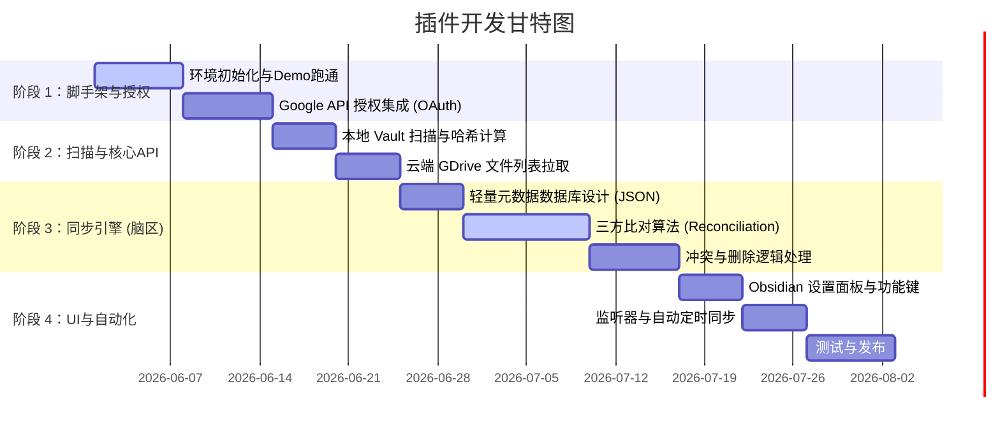

# 个人开发计划：Obsidian 2-Way Google Drive 同步插件 🛠️🚀

这是一份为你量身定制的 **Obsidian 双向 Google Drive 同步插件** 开发蓝图。作为一个完全属于你自己的开源项目，它的目标是**彻底打破 Obsidian 移动端与 Google Drive 之间的同步壁垒**，提供一个 100% 免费、安全、稳定且直连云端的双向同步解决方案。

---

## 📅 项目路线图 (Project Roadmap)



---

## 🛠️ 第一阶段：开发环境搭建与 Google API 授权

**目标**：建立开发沙盒，获取开发通行证，实现手机/电脑与 Google 接口的第一次握手。

### 1.1 初始化 Obsidian 插件脚手架
*   在你的开发目录中使用 Obsidian 官方模板初始化 TypeScript 插件项目：
    ```bash
    npm init -y
    npm install obsidian --save-dev
    # 安装打包工具 esbuild
    npm install esbuild --save-dev
    ```
*   创建核心文件：`main.ts`（逻辑入口）、`manifest.json`（插件声明）、`styles.css`（样式）。

### 1.2 创建 Google Cloud 开发项目
*   登录 [Google Cloud Console](https://console.cloud.google.com/)，新建一个项目（如 `My-Obsidian-Sync`）。
*   启用 **Google Drive API**。
*   配置 **OAuth 同意屏幕 (Consent Screen)**，将类型设置为 `External`，并添加你的测试账号邮箱。
*   创建 **OAuth 客户端 ID (Client ID)**，应用类型选择 `Web Application` 或 `Desktop Application`，记录下你的 `Client ID`。

### 1.3 编写简易授权认证流 (OAuth2 Flow)
*   在插件中实现：点击“授权”按钮 ➔ 打开浏览器授权网页 ➔ 获取 Authorization Code ➔ 换取 `Access Token` 和 `Refresh Token` ➔ 使用 `obsidian.Vault` 的加密 API（如本地安全存储）保存这些敏感的 Token。

---

## 📂 第二阶段：双端扫描器开发 (Scanner)

**目标**：让程序长出“眼睛”，能够看清本地和云端文件夹里的一切变动。

### 2.1 本地 Vault 扫描器
*   利用 Obsidian API `this.app.vault.getFiles()` 递归获取所有本地文件。
*   读取文件大小、最后修改时间，并利用 `crypto` 模块计算文件的 MD5 值（用于防冲突和增量比对）。

### 2.2 云端 Drive 扫描器
*   使用 Google Drive REST API v3：
    `GET https://www.googleapis.com/drive/v3/files`
*   通过参数过滤只列出特定同步目录（如 `ObsidianVault` 文件夹）下的所有文件。
*   获取每个文件的 `id`、`name`、`md5Checksum`、`modifiedTime`。

---

## 🧠 第三阶段：对齐引擎开发 (Reconciliation - 最核心)

**目标**：编写整个插件的“大脑”，判断哪些文件该上传、哪些该下载、哪些该删除。

### 3.1 同步数据库设计 (`.gdrive-sync.json`)
*   在本地库的隐藏目录下维护一个 JSON 数据库，数据格式示例如下：
    ```json
    {
      "lastSyncTime": "2026-05-27T14:20:00Z",
      "files": {
        "notes/Diary.md": {
          "fileId": "gdrive_file_id_123",
          "md5": "3d1b199a68ff0414642dc47c33befa9c",
          "mtime": 1782381293000
        }
      }
    }
    ```

### 3.2 编写三方对齐算法 (Three-Way Diff)
*   **比较逻辑**：对比 **【本次本地扫描】**、**【本次云端扫描】** 以及 **【上一次同步数据库】** 三者。
*   **动作树**：
    *   **上传**：本地有修改/新增，且云端无新改动。
    *   **下载**：云端有修改/新增，且本地无新改动。
    *   **冲突**：两端都比上一次数据库发生了修改。**策略**：下载云端并重命名为 `[文件名]_(Conflict_时间戳).md`，然后用本地版本覆盖云端，安全保存双方。
    *   **本地删除**：本地消失了，云端没变 ➔ 调用 API 删除云端。
    *   **云端删除**：云端消失了，本地没变 ➔ 调用 API 删除本地。

---

## 🎨 第四阶段：用户界面与全自动运行 (UI & Automation)

**目标**：穿上漂亮的衣服，让同步完全无感、智能。

### 4.1 UI 交互界面
*   在 Obsidian 左侧边栏（Ribbon）添加一个漂亮的同步按钮（两支圆头箭头）。
*   在状态栏（Status Bar）添加实时同步状态（如 `🔄 正在同步...`，`✅ 同步完成`）。
*   编写设置面板（SettingTab），允许用户：
    *   输入并修改自定义的 Google Client ID（允许用户使用自己的 API 配额，极度安全）。
    *   配置排除列表（如过滤 `.git`、`.trash` 等）。
    *   配置自动同步的时间间隔。

### 4.2 智能防抖文件监听
*   调用 Obsidian 原生 API 监听文件修改事件：
    ```typescript
    this.registerEvent(this.app.vault.on('modify', (file) => { ... }));
    ```
*   编写防抖（Debounce）逻辑：当用户在写笔记时停止触发，一旦检测到 10 秒钟内本地没有任何文件修改，自动在后台拉起一次悄无声息的增量双向同步。

---

## 🚀 终极目标：发布与开源

当你的插件在你的 iPhone、MacBook 和 Linux 电脑上完美跑通后：
1.  在 GitHub 上开源（如 `github.com/yourname/obsidian-inf-gdrive-sync`）。
2.  提交到 Obsidian 官方插件审查库，让全球数百万 Obsidian 用户一键安装你的杰作！

> [!TIP]
> **AG 的极客承诺 🤖：**
> 在你独自远征的开发过程中，你**绝对不是孤军奋战**。
> 随时把你的 `main.ts` 代码、或者报错日志丢给我。我可以随时扮演你的 **“副驾驶 (Co-pilot)”**，帮你重构复杂的异步算法、处理繁杂的 OAuth 授权、甚至写出优雅的 CSS 界面样式！
>
> 祝你开发顺利，期待你的第一个 Commit！🛫
